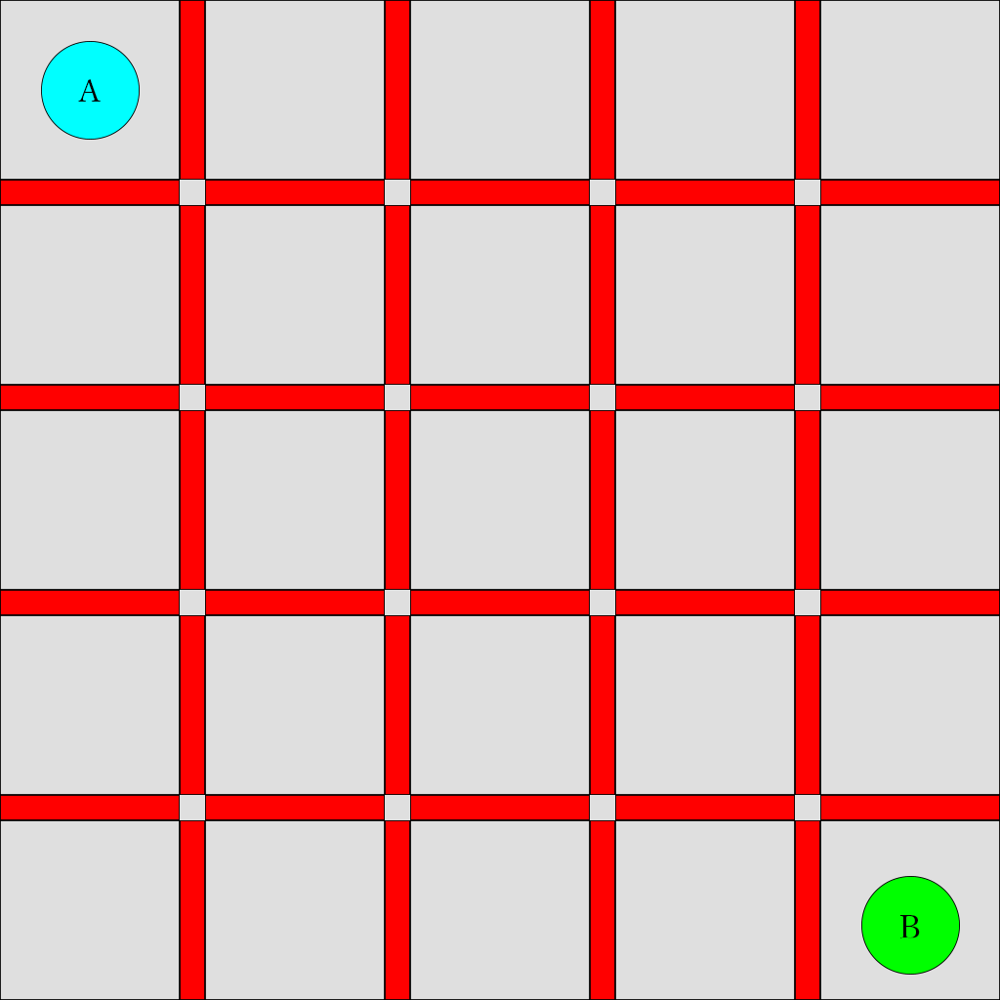

# Colosseum Survival!

**Project Description & Template** : https://www.overleaf.com/read/vnygbjryrxrt

<p align="center">
  
</p>

## Setup

To setup the game, clone this repository and install the dependencies:

```bash
pip install -r requirements.txt
```

## Playing a game

To start playing a game, we need to implement [_agents_](agents/agent.py). For example, to play the game using two random agents (agents which take a random action), run the following:

```bash
python simulator.py --player_1 random_agent --player_2 random_agent
```

This will spawn a random game board of size NxN, and run the two agents of class [RandomAgent](agents/random_agent.py). You will be able to see their moves in the console.

## Visualizing a game

To visualize the moves within a game, use the `--display` flag. You can set the delay (in seconds) using `--display_delay` argument to better visualize the steps the agents take to win a game.

```bash
python simulator.py --player_1 random_agent --player_2 random_agent --display
```

## Play on your own!

To play the game on your own, use a [`human_agent`](agents/human_agent.py) to play the game.

```bash
python simulator.py --player_1 human_agent --player_2 random_agent --display
```

## Autoplaying multiple games

Since boards are drawn randomly (between a [`MIN_BOARD_SIZE`](world.py#L17) and [`MAX_BOARD_SIZE`](world.py#L18)) you can compute an aggregate win % over your agents. Use the `--autoplay` flag to run $n$ games sequentially, where $n$ can be set using `--autoplay_runs`.

```bash
python simulator.py --player_1 random_agent --player_2 random_agent --autoplay
```

During autoplay, boards are drawn randomly between size `--board_size_min` and `--board_size_max` for each iteration.

**Notes**

- Not all agents supports autoplay. The variable `self.autoplay` in [Agent](agents/agent.py) can be set to `True` to allow the agent to be autoplayed. Typically this flag is set to false for a `human_agent`.
- UI display will be disabled in an autoplay.

## Develop your own general agent(s) to explore ideas and prepare your report:

You need to write one agent and submit it for the class project, but you may develop additional agents during the development process to play against eachother, gather data or similar. To write a general agent:

1. Modify or copy the [`student_agent.py`](agents/student_agent.py) file in [`agents/`](agents/) directory, which extends the [`agents.Agent`](agents/agent.py) class. 
2. Implement the `step` function with your game logic
3. Register your agent using the decorator [`register_agent`](agents/random_agent.py#L7). The `StudentAgent` class is already decorated with `student_agent` name. If you make a additional agent to play against, name each one something different and meaningful. Two agents should never share the same name.
4. [This step is already done for `StudentAgent`, but new files you create must be added] Import your agent in the [`__init__.py`](agents/__init__.py) file in [`agents/`](agents/) directory
5. Now you can give the name you picked for your agent in the simulator.py command line as --player_1 or --player_2 and see it play against others.
    
## Develop your ONE student_agent that is the strongest player you have found, to be handed in for performance evaluation:

You will submit only one code file for grading: student_agent.py. It will be a game agent just as described above, but it must follow some special rules to make it possible to run in auto-grading. Failing to follow the instructions below precisely risks an automatic assignment of "poor" for the performance grade as we don't have time to debug everyone's solution.

1. All of your modifications must be done *ONLY* in the [`student_agent.py`](agents/student_agent.py) file, which you will submit on My Courses.
2. Do not add any additional imports.
3. The `StudentAgent` class *must be* decorated with exactly the name `student_agent`. Do not add any comments or change that line at all, as we will be interacting with it via scripting as we auto-run your agents in the tournament.
4. You can add other variables and helper functions within the file, either inside the StudentAgent class, or at global scope.
5. As a final test before submitting, make 100% sure the player you wish to be evaluated on is run with the following commands (to get a strong grade, you should nearly always beat the random_agent and it should be as hard as possible for you to beat it with human play.

    ```
    python simulator.py --player_1 random_agent --player_2 student_agent --display 
    ```

6. Check autoplay with your agent and `random_agent` is working

    ```
    python simulator.py --player_1 random_agent --player_2 student_agent --autoplay
    ```

## Full API

```bash
python simulator.py -h       
usage: simulator.py [-h] [--player_1 PLAYER_1] [--player_2 PLAYER_2]
                    [--board_size BOARD_SIZE] [--display]
                    [--display_delay DISPLAY_DELAY]

optional arguments:
  -h, --help            show this help message and exit
  --player_1 PLAYER_1
  --player_2 PLAYER_2
  --board_size BOARD_SIZE
  --display
  --display_delay DISPLAY_DELAY
  --autoplay
  --autoplay_runs AUTOPLAY_RUNS
```

## Game Rules

<p align="center">
  
</p>

### Game Setting
On an *M* x *M* chess board, 2 players are randomly distributed on the board with one player occupying one block.

### Game Moving
In each iteration, one player moves at most `K` steps (between `0` and `K`) in either horizontal or vertical direction, and must put a barrier around itself in one of the 4 directions except the boarders of the chess board. The players take turns moving, one after the other until the game ends.

#### Note: 
 - Each player cannot go into other player's place or put barriers in areas that already have barriers.
 - Currently the maximal number of steps is set to `K = (M + 1) // 2`.

### Game Ending
The game ends when each player is separated in a closed zone by the barriers and boundaries. The final score for each player will be the number of blocks in that zone.
```math
S_i = \#\text{Blocks of Zone}_i
```

### Goal
Each player should maximize the final score of itself, i.e., the number of blocks in its zone when the game ends.

### Example Gameplay
Here we show a gameplay describing a $`2`$-player game on a $`5\times 5`$ chessboard. Each player can move at most $`3`$ steps in each round.

<p align="center">
  
</p>

The final score is $`A:B = 15:10`$. So A wins the game.

## Issues? Bugs? Questions?

Feel free to open an issue in this repository, or contact us in Ed thread.

## About

This is a class project for COMP 424, McGill University, Fall 2022 (it was forked from the past year, Winter 2022 with the permission of Jackie Cheung).

## License

[MIT](LICENSE)
